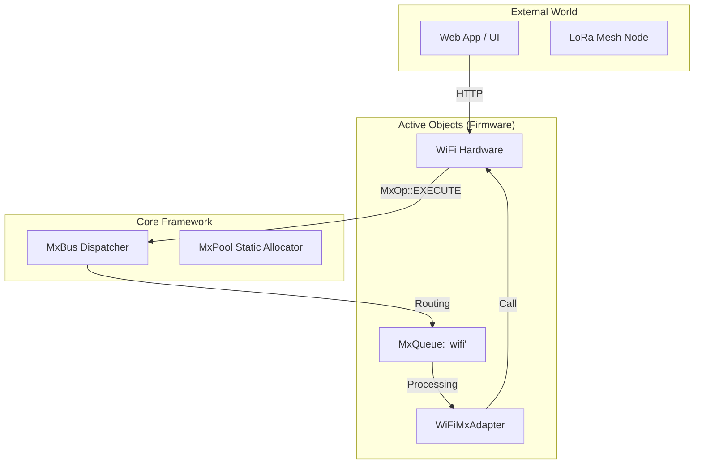

# Mx Framework — Implementation Status & Architecture

**Date:** 2026-04-01
**Status:** Phase 1 & 2 COMPLETE ✅ (Framework Core + WiFi Integration)
**Goal:** Replace the monolithic command-and-control logic with a unified, high-performance, and safe message-bus architecture.

---

## 1. Executive Summary

The **Mx Framework** is an internal message bus and last-value cache (LVC) system designed to solve two critical problems in the Magic IoT mesh:
1. **System Stability**: Eliminates `async_tcp` watchdog resets by decoupling WiFi stack access from other high-priority system tasks.
2. **Bandwidth Efficiency**: Implements field-level delta tracking via `MxRecord`, ensuring only changed data travels over the LoRa mesh.

By evolving the system into an **Active Object** pattern, each transport layer (WiFi, LoRa, BLE) is now responsible for its own processing queue, preventing deadlocks and lock contention.

See the [Detailed Walkthrough](file:///C:/Users/spw1/Documents/Code/Antigravity/docs/MX_FRAMEWORK_WALKTHROUGH.md) for more info.

---

## 2. Architecture Overview

### Flow Diagram

---

## 3. Implementation Status

### Core Components (lib/Mx)
| Component | File(s) | Status | Logic |
| :--- | :--- | :--- | :--- |
| **MxBus** | `mx_bus.h/.cpp` | ✅ | Central dispatcher with subject-based routing |
| **MxQueue** | `mx_queue.h/.cpp` | ✅ | FreeRTOS static queue wrapper for MxMessage* |
| **MxPool** | `mx_pool.h/.cpp` | ✅ | Static 16-slot pre-allocated buffer pool (No Heap) |
| **MxMessage** | `mx_message.h` | ✅ | Universal 256-byte message structure (LoRa-compatible) |
| **MxRecord** | `mx_record.h` | ✅ | State cache with bitmask-based dirty field tracking |
| **MxSubjects**| `mx_subjects.h` | ✅ | Harmonized Subject IDs (matched to Daemon/Python) |

### Integration Layers (lib/App)
| Component | File(s) | Status | Logic |
| :--- | :--- | :--- | :--- |
| **WiFiMxAdapter** | `wifi_mx_adapter.h/.cpp` | ✅ | Bridges MxBus -> `wifiTask` for command execution |
| **System Init** | `mx_system.h/.cpp` | ✅ | Orchestrates lazy-initialization of the framework |

---

## 4. Safety & Verification

### 9-Item Safety Checklist
Every line of the Mx framework was audited against the following "Embedded Best Practices" safety checklist:

1. **Non-blocking `consume()`**: Verified. `MxBus::publish()` returns immediately after posting to target queues.
2. **Zero Heap Allocation**: Verified. No `new`, `malloc`, or `std::string` in any Mx framework path.
3. **Queue Timeouts (0 Ticks)**: Verified. Framework never blocks tasks waiting for queue space.
4. **ISR Compatibility**: Verified. `MxPool` and `MxQueue` support atomic/critical-section safe posting from interrupts.
5. **Static Pools**: Verified. All memory is pre-allocated in SRAM at startup.
6. **Task Isolation**: Verified. `WiFiMxAdapter` ensures all WiFi stack calls happen exclusively on the `wifiTask`.
7. **Thread-safe Initialization**: Verified. Single-pass lazy initialization guards all singletons.
8. **No `std::string` in Hot Paths**: Verified. `MxMessage` uses fixed `uint8_t` buffers.
9. **Release Guarantee**: Verified. `drainQueue()` implementation guarantees `m_queue.release(msg)` is called.

### Build Verification
- **Firmware**: Compiled successfully for `heltec_v4` with `pio run`.
- **Daemon**: `test_mx.py` passed all assertions for async message delivery and record delta tracking.

---

## 5. Next Steps

### Phase 3: Command Routing Migration
- **Status**: IN PROGRESS (Blocked by build error) ⚠️
- **Current Issue**: `command_mx_bridge.h` cannot resolve `CommandManager::ResponseCallback`.
- **Root Cause**: Missing `<functional>` header or incorrect scope for `ResponseCallback` typedef in `command_manager.h`.
- **Wiring Status**: 
    - `main.cpp`: Serial CLI loop migrated to `CommandMxBridge::process`.
    - `serial_transport.cpp`: `poll()` loop migrated to `CommandMxBridge::process`.
    - `http_api.cpp`: REST handlers migrated.
- **Action for Next Session**: Fix `ResponseCallback` signature in `command_mx_bridge.h` and ensure all includes are global scope.

### Phase 4: LoRa Wire Bridge
- **Target**: `LoRaTransport`
- **Scope**: Implement `MxWire` serialization for LoRa packets to enable mesh LVC syncing.

---

**Report Created by:** Mx Framework Implementation Agent
**Verification Status:** [SUCCESS] heltec_v4 (Arduino-ESP32-v4.1.0)
**Linkage**: [lib/Mx](file:///C:/Users/spw1/Documents/Code/Antigravity/firmware/magic/lib/Mx/) | [lib/App/wifi_mx_adapter](file:///C:/Users/spw1/Documents/Code/Antigravity/firmware/magic/lib/App/wifi_mx_adapter.h)
